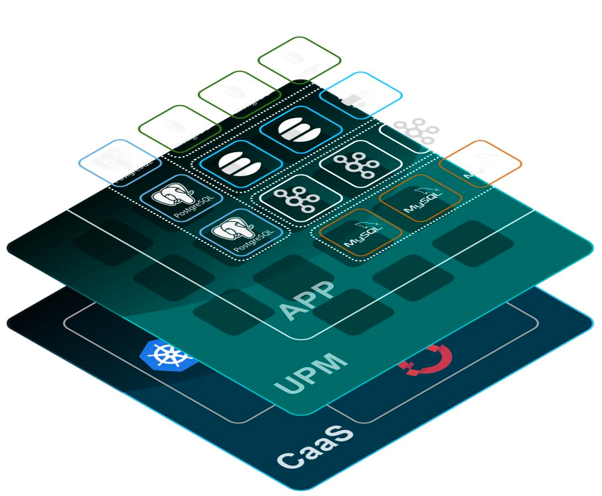

# upm-doc

> [English](README.md) | [Chinese](README_zh.md)

## Welcome to explore **upm**!

Welcome to the world of UPM!
UPM ( Unified Platform Management ) is a Kubernetes-based Middleware and database service management software that supports the operation and maintenance management of databases and Middleware services such as MySQL, Redis, Kafka, Zookeeper, Elastcsearch, etc. It mainly focuses on the automation of Cloud Native services, such as deployment, release, operation and maintenance, and availability protection .
The core capabilities provided by UPM are defined based on CRD extensions, which do not exist in any external dependencies and can run in Kubernetes clusters.

## Core competencies
- Unified workload
    - UPM includes a set of common Workloads, Units, and UnitSets. These workloads can support various types of databases and Middleware services
    - Using templates to define workloads in a scalable way is a new way of extension that can help customers define extensions for specific types and versions of services, such as adding the definition of sidecar containers, automatically injecting monitoring programs or security check containers.
    - Template-based management configuration and definition expansion
- Scalable advanced application operation and maintenance capabilities
    - Support MySQL Replciaton Management
    - Support Proxysql Sync Management
    - Support Redis Replicaton management
    - Support Redis Cluster Management
- Unified operation and maintenance work flow management and UI interface
    - Global unified resource management capability
    - Database cluster load work flow management
    - Ticket Operation and Maintenance Process management
    - Unified UI management interface

## Relationship comparison
### UPM vs. Kubernetes
Simply put, UPM is an auxiliary extension capability enhancement for Kubernetes.
Kubernetes already provides some application deployment management capabilities, such as some basic workloads . But for databases and stateful services like Middleware, with complex cluster architectures, these basic functions such as statfulset are far from enough.
UPM can be easily installed into any Kubernetes cluster, and it makes up for the shortcomings of Kubernetes in the areas of database and Middleware service application deployment, upgrade, protection, operation and maintenance.

### UPM vs. Platform-as-a-Service (PaaS)
UPM is not a PaaS platform and does not offer any PaaS layer capabilities.
UPM is divided into two layers. UPM Platform is the platform management layer, which manages the database and Middleware service application definition by calling the Kubernetes interface. UPM Engine is the execution engine layer, which is a Kubernetes standard extension suite, currently including two Operators, TesseractCube and Kauntlet . The PaaS platform can make application deployment and management processes more powerful and efficient by using these extension functions provided by UPM Engine.

## Documentation
* [Architecture Design](docs/arch.md)