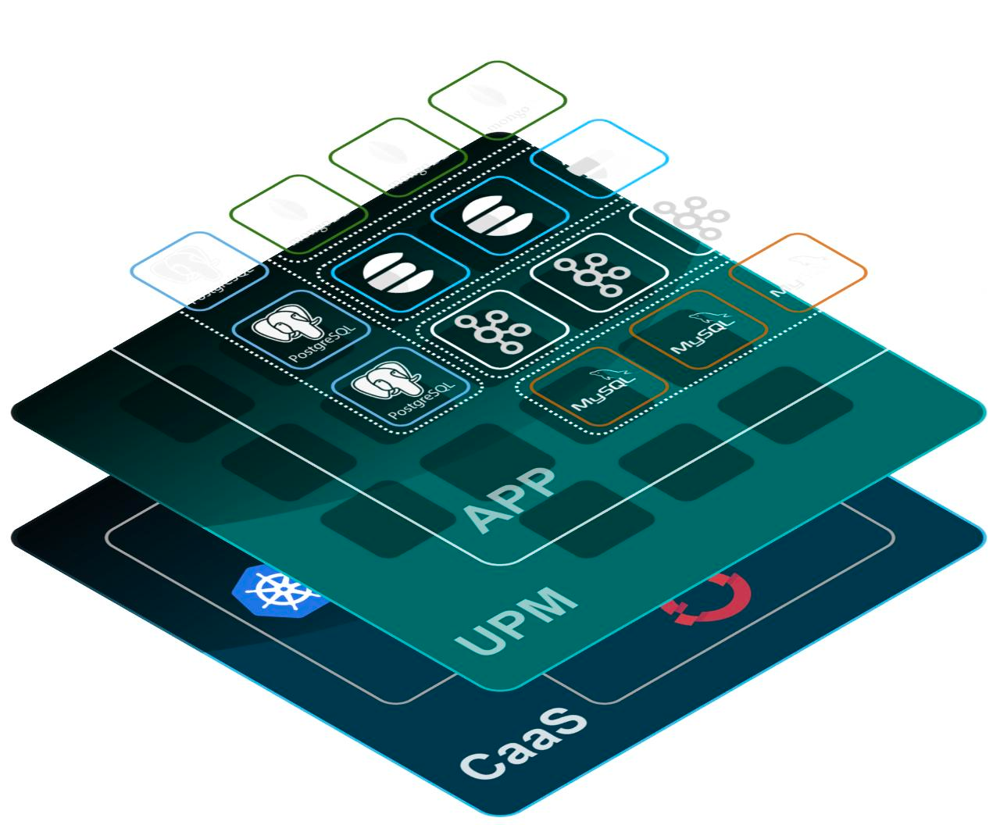

# upm-doc

> [English](README.md)  | [Chinese](README_zh.md)

## 欢迎探索 **upm**!

欢迎来到 UPM 的世界！
UPM（Unified Platform Management）统一管理平台软件是基于 Kubernetes 的中间件及数据库服务管理软件，支持对 MySQL、Redis、Kafka、Zookeeper、Elastcsearch 等数据库及中间件服务运维管理，主要聚焦于云原生服务的自动化，比如部署、发布、运维以及可用性防护。
UPM 提供的核心能力都是基于 CRD 扩展来定义，它们不存在于任何外部依赖，可以运行在Kubernetes 集群中。

## 核心能力
- 统一的工作负载
    - UPM 包含了一组通用的 Workloads（工作负载），Unit、UnitSet。这些工作负载可以支持多种类型的数据库及中间件服务
    - 使用模版方式对工作负载进行可扩展定义，这是一种全新的扩展方式，可以帮助客户对特定类型和版本的服务进行定义扩展，比如通过添加Sidecar容器的定义，自动注入监控程序或者安全检查容器。
    - 基于Template管理配置及定义扩张
- 可扩展的高级的应用运维能力
    - 支持 MySQL Replciaton 管理
    - 支持 Proxysql Sync 管理
    - 支持 Redis Replicaton 管理
    - 支持 Redis Cluster 管理
- 统一的运维工作流管理及UI界面
    - 全局统一资源管理能力
    - 数据库集群负载工作流管理
    - 工单运维流程管理
    - 统一的UI管理界面
    
## 关系对比
### UPM vs. Kubernetes
简单来说，UPM 对于 Kubernetes 是一个辅助扩展能力增强。
Kubernetes 自身已经提供了一些应用部署管理的功能，比如一些基础工作负载。 但对于数据库及中间件这类有状态服务，并且带有复杂集群架构的场景，这些基础功能比如statfulset是远远不够的。
UPM 可以被很容易地安装到任意 Kubernetes 集群中，它弥补了 Kubernetes 在数据库及中间件服务应用部署、升级、防护、运维 等领域的不足。
### UPM vs. Platform-as-a-Service (PaaS)
UPM 不是一个 PaaS 平台，并且也不会提供任何 PaaS 层的能力。
UPM 分为两层，UPM Platform 是平台管理层，通过调用 Kubernetes 的接口来管理数据库及中间件服务应用定义 。 UPM Engine是执行引擎层，它是一个 Kubernetes 的标准扩展套件，目前包括 TesseractCube 和 Kauntlet 两个Operator。 PaaS 平台可以通过使用 UPM Engine 提供的这些扩展功能，来使得应用部署、管理流程更加强大与高效。