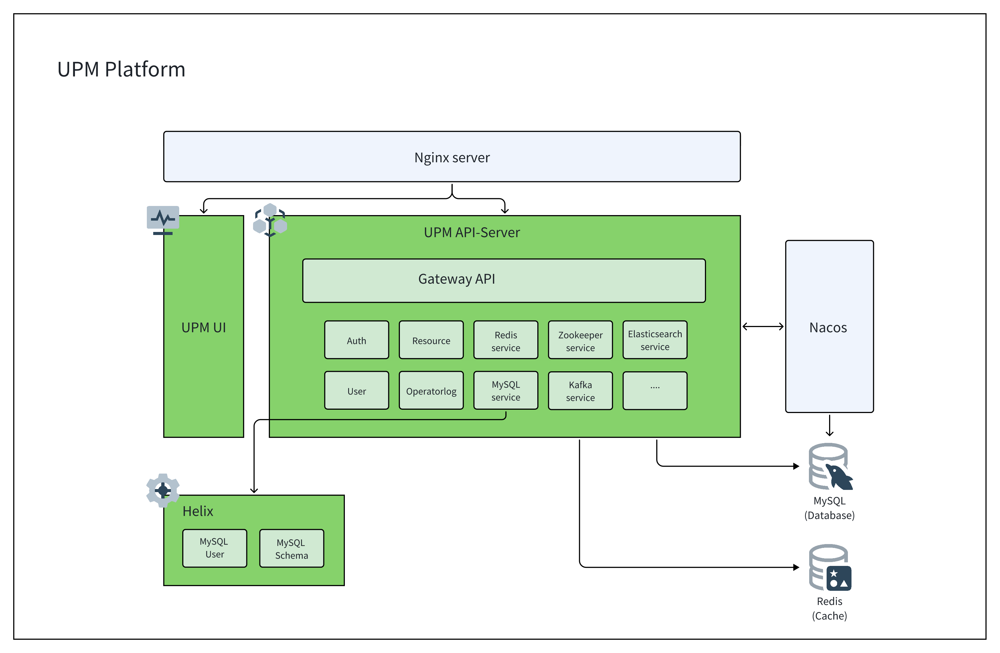
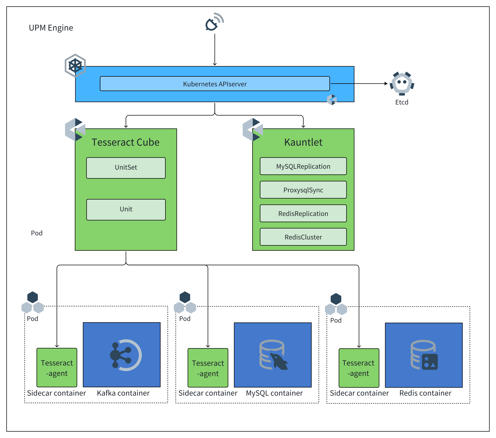
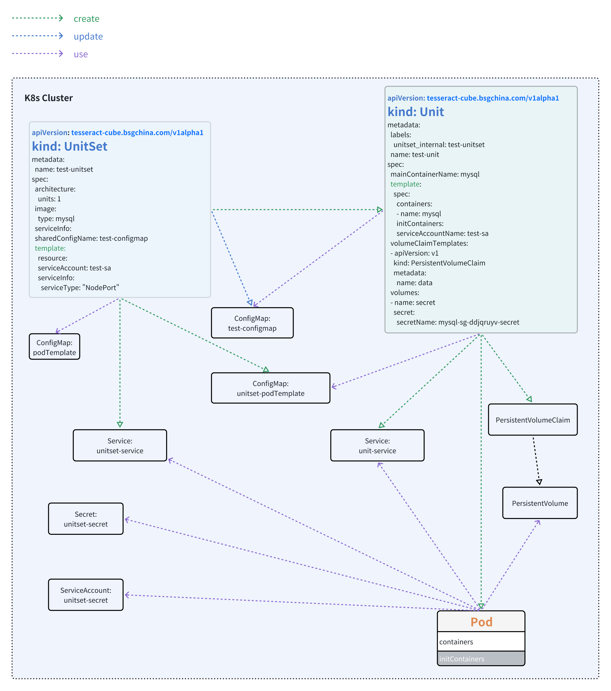
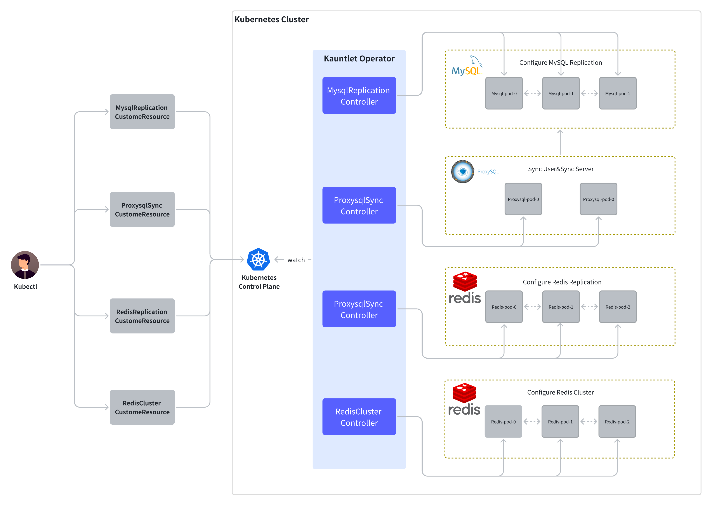

# Architecture Design
UPM is a complex system composed of many different parts. To help UPM users and developers establish a theoretical model of its working principle, this page documents the system architecture.

## Design concept

UPM adopts the classic "hub-agent" architecture design, which is divided into two parts: management platform layer and execution engine layer. It can meet the needs of Kubernetes multi-cluster orchestration, and is a powerful, modular, and scalable platform. In UPM, we will break away from the decentralized design concept and imperative architecture, and embrace the "hub-agent" architecture consistent with the original pattern of "hub-kubelet" in Kubernetes. Therefore, in UPM, our management platform layer is intuitively modeled as "Hub", while each cluster managed by "Hub" is "agent". Here is a more detailed explanation of the two models that we will use frequently in the world of UPM:
- **UPM Platform**: The core control platform of UPM, used to provide API interfaces to the outside world and manage resource objects CR in Kubernets API using workflow. Designed with "microservices" architecture, it can be quickly scaled to meet the operation and maintenance needs of various databases and Middleware.
- **UPM Engine**: The execution engine of UPM, which is designed using the Kubernetes Operator framework. It is a set of Kubernetes-based extension suites, mainly focusing on general stateful service automation and advanced operation and maintenance automation of data applications . It is composed of two self-developed Operators. In order to better support multiple types of databases and support cluster architecture of multiple databases, we designed a general workload to meet the workload management mode of databases and Middleware services.

Benefiting from the advantages of the architecture, at the abstract level, we decouple most of the multi-cluster operations into (1) computation/decision-making and (2) execution, and the actual execution of the target cluster will be completely unloaded into the UPM Engine , while the UPM Platform will focus on better orchestration of tasks and interface calls through workflow. The UPM Engine will not directly execute operations, but declaratively maintain the CRD in each cluster. The UPM Platform will actively pull the CRD status from Kubernets and make the next task content orchestration. The execution burden of the UPM Platform will be greatly reduced, because the UPM Platform does not need to handle the event flood from the Kubernetes cluster, nor does it need to send a large number of requests to various Kubernetes clusters. Imagine that if there is no kubelet in the Kubernetes, but the container daemon is directly operated by the control plane, it will be extremely difficult for a centralized controller to manage a cluster with more than 5000 nodes. Similarly, this is also the way UPM tries to break through the scalability bottleneck, that is, to split the "execution" into individual agents, so that the UPM Platform can accept and manage multiple clusters.

## UPM Platform
UPM Platform is the core control platform of UPM, used to provide API interfaces to the outside world and manage execution workflows. Designed using a "microservice" architecture, it can be quickly scaled.
### Architecture

The UPM Platform consists of three parts:
- UPM UI : The management interface provided by UPM provides a unified UI interface for administrators.
- UPM API-Server : UPM Platform management core, designed and developed based on SpringCloud microservice framework, using Restful API to provide management capabilities, using MySQL database to store and manage data, using Redis cache to accelerate data query capabilities.
- Helix : UPM Platform extension component, providing scalable capabilities for database services and Middleware services. Currently supports MySQL user management and MySQL library management.

### Microservice design
UPM API-Server, as the management core, plays an important role. It needs to meet the growing operation and maintenance needs of users and the emerging new service management needs in the open source community. Microservice design is an architecture design that can meet the above requirements. Microservices: an architectural style that decomposes application functionality into a set of services. Each service is composed of a focused and cohesive set of functional responsibilities. Each service is loosely coupled, has its own private database, and communicates through APIs. Each service can be independently developed, deployed, tested, and scaled.

### List of microservice modules
| Serial number | Name                  | Description                                                  |
| ------------- | --------------------- | ------------------------------------------------------------ |
| 1             | Gateway API           | The Gateway API module is responsible for receiving external requests and routing them to the corresponding microservice module |
| 2             | Auth                  | The Auth module is responsible for user authentication and permission management |
| 3             | Resource              | The Resource module provides management of system resources, such as projects, Kubernetes clusters, nodes, storage classes, software, etc. |
| 4             | User                  | The User module is responsible for the management and operation of user information. |
| 5             | OperatorLog           | The OperatorLog module records system operation logs for tracking system operations. |
| 6             | MySQL service         | The MySQL service module provides complete operation and maintenance workflow control and management functions for MySQL databases. |
| 7             | Redis service         | The Redis service module provides complete operation and maintenance workflow control and management functions for Redis cache. |
| 8             | Redis-Cluster service | Redis-Cluster service module provides complete operation and maintenance workflow control and management functions for Redis cluster cache. |
| 9             | Kafka service         | The Kafka service module provides complete operation and maintenance workflow control and management functions for Kafka event flow. |
| 10            | Zookeeper service     | The Zookeeper service module provides complete operation and maintenance workflow control and management functions for Zookeeper Service Discovery. |
| 11            | Elasticsearch service | The Elasticsearch service module provides complete operational workflow control and management capabilities for the Elasticsearch search engine. |

## UPM Engine
UPM Engine is the execution engine of UPM, which is designed using the Kubernetes Operator framework. It is a set of Kubernetes-based extension suites, mainly focusing on general stateful service automation and advanced operation and maintenance automation of data applications *.* It is composed of two self-developed Operators for Kubernetes. In order to better support multiple types of databases and support multiple database cluster architectures, we designed a general workload to meet the workload management mode of databases and Middleware services.

### Architecture

UPM Engine consists of two parts:
- Tesseract Cube is a general-purpose workload operator that enhances and extends database and Middleware stateful services.
- Kauntlet : is an advanced operation and maintenance operation Operator, using an extensible CRD way to make up for the complex operation and maintenance functions in special operation and maintenance scenarios.

### Operator design
In the field of robotics and automation, a control loop is a non-terminating loop used to regulate the system state.

This is an example of a control loop: an automatic temperature regulator in a room.
When you set the temperature, you tell the thermostat your desired state (Desired State) . The actual temperature of the room is the current state (Current State) . By switching the device, the thermostat makes its current state close to the desired state.

In Kubernetes, the controller monitors the common state of the cluster and works to transform the current state into the desired state.

Kubernetes takes a Cloud Native view of the system and can handle constant change.

During task execution, the cluster may be modified at any time, and the control loop will automatically repair the fault. This means that it is very likely that the cluster will never reach a stable state.

As long as the controllers in the cluster are running and effectively modified, the stability of the overall state is irrelevant.

As one of the design principles, UPM uses multiple controllers, each of which manages a specific aspect of the cluster state. The most common specific controller uses one type of resource as its expected state, and the controller manages and controls another type of resource to evolve towards its expected state. For example, the UnitSet controller tracks the Unit object (to discover new tasks) and the Pod object (to run the Unit and then see when the task is completed). In this case, the new task creates the Unit, and the Unit controller creates the Pod.

Using a simple controller instead of a set of interconnected individual control loops is very useful. Controllers will fail, so the design of UPM takes this into account.

### Tesseract Cube
Tesseract Cube is a universal workload operator used to unify database and Middleware workload management capabilities, avoiding the problem of managing different operators.
- UPM includes a set of common Workloads, Units, and UnitSets. These workloads can support various types of databases and Middleware services
- Using templates to define workloads in a scalable way is a new way of extension that can help customers define extensions for specific types and versions of services, such as adding the definition of sidecar containers, automatically injecting monitoring programs or security check containers.
- Template-based management configuration and definition expansion

At the heart of the Tesseract Cube is control, which keeps track of a type of Kubernetes resource. These CRDs have a spec field that represents the desired state. The controller of the resource is responsible for ensuring that its current state is close to the desired state.

Controllers may perform actions on their own; more commonly in Kubernetes, a controller sends information to the API server , which can have side effects. See examples later.

Tesseract Cube provides custom resource definition (CRD) for two generic workloads, UnitSet and Unit , specifically UnitSet . It is the main custom resource definition (CR) you interact with when using Tesseract Cube.
#### Unit
Unit is the process of filling items in a way that maximizes the use of boxes. This extends to Nomad, where the Client is the "trash can" and the project is the task group. Nomad optimizes resources by efficiently packaging tasks to the Client's computer.

Unit (like a block on a Rubik's cube) is the sum of resource objects required by a service instance. Unit contains a Pod , a configuration file used by the running service, a persistent  storage volume  for storing data usage; Unit integrates and utilizes the necessary resources contained in service operation and maintenance in a complete service instance lifecycle management manner.
#### UnitSet
UnitSet is a workload API object used to manage general-purpose stateful database instances.

UnitSet is used to manage the deployment and scaling of Unit collections, and provides persistent storage and identifiers, configuration file templates, encryption information, authentication certificates, and rolling update policies for these Units. UnitSet manages a group of Units based on a set of Pod specifications of the same type.

The following diagram provides an overview of what makes up a UnitSet . Key parts are highlighted with arrows pointing to related objects. The following sections of this document explain the various parts of the diagram.

### Kauntlet
Kauntlet is a Kubernetes-based project aimed at managing traditional database applications such as MySQL and Redis through custom resource definition (CRDs). It simplifies the process of deploying and managing databases in Kubernetes clusters, providing functions such as setting up MySQL leader/follower replication relationships and building Redis cluster architecture.

Unlike other operators in the community, Kauntlet does not generate low-level Pod instances and only manages the replication relationship between instances. With this design, we can also manage database instances outside the Kubernetes cluster.

Kauntlet is built using the Operator framework .

Supported functional scope
- **MysqlReplication**
- Manages the leader/follower replication relationship between MySQL, supports leader/follower switching by changing the topology structure in Spec, and separates read and write of MySQL leader/follower replication service by updating Pod tags. MysqlReplication can automatically manage the deployment and configuration of MySQL leader/follower replication, monitor replication status, and automatically elect a new master node when the master node fails. This ensures high availability and data consistency of the database cluster, reducing manual intervention and operation and maintenance costs.
- **RedisReplication**
- Manage the leader/follower replication relationship between Redis and support compatibility with Redis sentinel architecture through skip-reconcile annotation. RedisReplication can automate the deployment and configuration of Redis leader/follower replication, monitor replication status, and automatically elect a new master node when the master node fails. This ensures high availability and data consistency of the database cluster, reducing manual intervention and operation and maintenance costs.
- **RedisCluster**
- Automatically build Redis Cluster architecture based on members and support automatic allocation of slots. RedisCluster can automate the deployment, configuration, and monitoring of Redis Cluster architecture clusters to ensure high availability and performance of the cluster. It can dynamically adjust data sharding policies according to the load of the cluster, and automatically perform failover when nodes fail, thereby minimizing intervention for operation and maintenance personnel.
- **ProxysqlSync**
- Monitor the actual topology status in MysqlReplication CRDs, update and maintain the mysql_server in ProxySQL, and support automatic filtering rules to synchronize users in MySQL. Proxysql is a high-performance open-source agent for load balancing and failover of MySQL and PostgreSQL database clusters. ProxysqlSync can automatically synchronize user and replication topology information of the database, assist MySQL in data access routing, and failover.

Our scalable advanced database operation and maintenance capability Operator can help users simplify the management of database clusters, improve operation and maintenance efficiency, reduce costs, and ensure high availability and stability of database clusters. At the same time, our Operator also supports customized expansion, which can flexibly add other database operation and maintenance capabilities according to user requests to meet the needs of different scenarios.

Here is the architecture diagram of our Kauntlet
