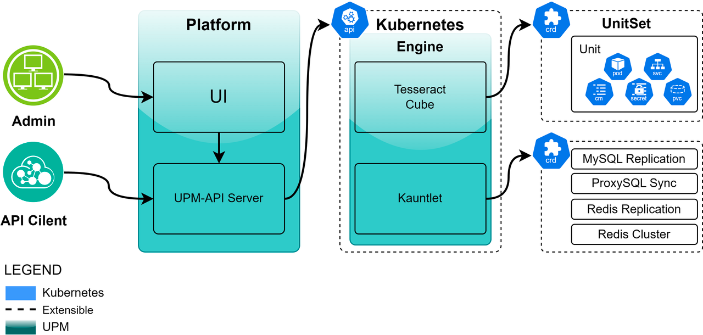
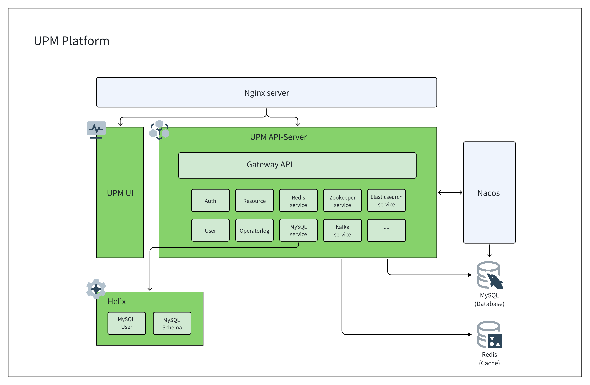
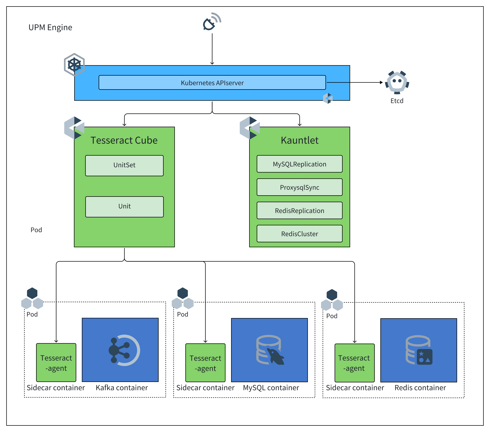

# 架构设计
UPM 是一个复杂的系统，由许多不同的部分组成。为了帮助 UPM 的用户和开发人员建立其工作原理的理论模型，本页面记录了系统架构。

## 设计理念

UPM 采用经典的“hub-agent”架构设计，分为管理平台层和执行引擎层，两个部分。他可以满足Kubernetes多集群编排的需求，是一个功能强大，模块化，可扩展的平台。在 UPM 中，我们将跳出过去中心化设计思路和命令式的架构，并拥抱与Kubernetes中“hub-kubelet”原始模式一致的“hub-agent”架构。 因此在 UPM 中，我们的管理平台层，被直观的建模为“Hub”, 而相对的，每一个被“Hub”管理的集群则为“agent”。 以下是对于两个模型更加详细的解释，我们将在 UPM 的世界中频繁的使用这两个模型：
- **UPM Platform**: UPM 的核心控制平台，用来对外提供API 接口，使用工作流方式管理 Kubernets API中的资源对象 CR 。使用 “微服务” 架构设计，可快速扩展，满足多种数据库和中间件的运维需求。
- **UPM Engine**: UPM 的执行引擎，它使用Kubernetes Operator 框架设计，它是一组基于 Kubernetes 的扩展套件，主要聚焦于通用有状态服务自动化和数据应用高级运维自动。为Kubernetes 由两个自主研发的Operator 构成的。为了更好的支持多种数据库的类型，并且支持多种数据库的集群架构，我们设计了一个通用的工作负载，来满足数据库及中间件服务的工作负载管理模式。

受益于架构的优点，在抽象层面，我们将大部分的多集群操作解耦为（1）计算/决策和（2）执行, 且对目标集群的实际执行，将会完全的卸入 UPM Engine 中，而UPM Platform将专注于通过工作流方式更好的编排任务及接口调用。 UPM Engine不会直接的执行操作，而是声明式的维护每一个集群中的 CRD ，UPM Platform 则会主动从Kubernets 中出拉取CRD 的状态并作出下一个任务内容的编排。 UPM Platform的执行任务负担将会大大减轻，因为UPM Platform 既不需要处理来自Kubernetes cluster的事件洪流，也不需要被发送大量的请求到各个Kubernetes 集群。 试想，如果Kubernetes中没有kubelet，而是由控制平面直接操作容器守护进程，那么对于一个中心化的控制器，管理一个超过5000节点的集群，将会极其困难。 同理，这也是 UPM 试图突破可扩展性瓶颈的方式，即将“执行”拆分卸入各个单独的代理中，从而让 UPM Platform 可以接受和管理多个集群。

## UPM Platform
UPM Platform 是 UPM 的核心控制平台，用来对外提供API 接口，管理执行工作流。使用 “微服务” 架构设计，可快速扩展。
### 架构

UPM Platform 由三个部分组成：
- UPM UI：UPM 提供的管理界面，为管理员提供统一的UI 界面。
- UPM API-Server：UPM Platform 管理核心，基于 SpringCloud 微服务框架设计开发，使用Restful API 提供管理能力，使用 MySQL 数据库存储管理数据，使用 Redis 缓存加速数据查询能力。
- Helix：UPM Platform 扩展组件，为数据库服务及中间件服务提供可扩展的能力。目前支持MySQL 用户管理，MySQL 库管理。

### 微服务设计
UPM API-Server作为管理核心，担任了重要核心角色。他需要满足用户不断增长的运维需求和开源社区中不断涌现出的新的服务管理需求。微服务设计就是能够满足以上需求的架构设计。微服务：把应用程序功能性分解为一组服务的架构风格。每个服务是一组专注的、内聚的功能职责组成。 每个服务是松耦合的，有自己的私有数据库，通过 API 通信。每个服务可以独立开发，部署，测试和扩展。

### 微服务模块清单
| 序号 | 名称                  | 描述                                                         |
| ---- | --------------------- | ------------------------------------------------------------ |
| 1    | Gateway API           | Gateway API模块负责接收外部请求并将其路由到相应的微服务模块  |
| 2    | Auth                  | Auth模块负责用户身份验证和权限管理                           |
| 3    | Resource              | Resource模块提供对系统资源的管理，比如项目、Kubernetes 集群、节点，存储类，软件等。 |
| 4    | User                  | User模块负责用户信息的管理和操作。                           |
| 5    | OperatorLog           | OperatorLog模块记录系统操作日志，用于追踪系统操作。          |
| 6    | MySQL service         | MySQL service 模块提供MySQL 数据库完整运维工作流控制和管理功能。 |
| 7    | Redis service         | Redis service 模块提供Redis缓存完整运维工作流控制和管理功能。 |
| 8    | Redis-Cluster service | Redis-Cluster service 模块提供Redis集群缓存完整运维工作流控制和管理功能。 |
| 9    | Kafka service         | Kafka service 模块提供Kafka 事件流完整运维工作流控制和管理功能。 |
| 10   | Zookeeper service     | Zookeeper service 模块提供Zookeeper 服务发现完整运维工作流控制和管理功能。 |
| 11   | Elasticsearch service | Elasticsearch service 模块提供Elasticsearch 搜索引擎完整运维工作流控制和管理功能。 |

## UPM Engine
UPM Engine 是 UPM 的执行引擎，它使用Kubernetes Operator 框架设计，它是一组基于 Kubernetes 的扩展套件，主要聚焦于通用有状态服务自动化和数据应用高级运维自动。为Kubernetes 由两个自主研发的Operator 构成的。为了更好的支持多种数据库的类型，并且支持多种数据库的集群架构，我们设计了一个通用的工作负载，来满足数据库及中间件服务的工作负载管理模式。

### 架构

UPM Engine 由两个部分组成：
- Tesseract Cube：是一个通用的工作负载的Operator，实现了对数据库及中间件有状态服务的增强和扩展。
- Kauntlet：是一个高级运维操作的Operator，使用可扩展的CRD的方式，补足了特殊运维场景下复杂运维功能。

### Operator 设计
在机器人技术和自动化领域，控制回路（Control Loop）是一个非终止回路，用于调节系统状态。

这是一个控制环的例子：房间里的温度自动调节器。

当你设置了温度，告诉了温度自动调节器你的期望状态（Desired State）。 房间的实际温度是当前状态（Current State）。 通过对设备的开关控制，温度自动调节器让其当前状态接近期望状态。

在 Kubernetes 中，控制器通过监控集群 的公共状态，并致力于将当前状态转变为期望的状态。

Kubernetes 采用了系统的云原生视图，并且可以处理持续的变化。

在任务执行时，集群随时都可能被修改，并且控制回路会自动修复故障。 这意味着很可能集群永远不会达到稳定状态。

只要集群中的控制器在运行并且进行有效的修改，整体状态的稳定与否是无关紧要的。

作为设计原则之一，UPM 使用多个控制器，每个控制器管理集群状态的一个特定方面。 最常见的一个特定的控制器使用一种类型的资源作为它的期望状态， 控制器管理控制另外一种类型的资源向它的期望状态演化。 例如，UnitSet 的控制器跟踪 Unit 对象（以发现新的任务）和 Pod 对象（以运行 Unit，然后查看任务何时完成）。 在这种情况下，新任务会创建 Unit，而 Unit 控制器会创建 Pod。

使用简单的控制器而不是一组相互连接的单体控制回路是很有用的。 控制器会失败，所以 UPM 的设计正是考虑到了这一点。

### Tesseract Cube
Tesseract Cube 是一个通用的工作负载的Operator，用来统一数据库及中间件的工作负载管理能力，避免了管理不同Operator的问题。
- UPM 包含了一组通用的 Workloads（工作负载），Unit、UnitSet。这些工作负载可以支持多种类型的数据库及中间件服务
- 使用模版方式对工作负载进行可扩展定义，这是一种全新的扩展方式，可以帮助客户对特定类型和版本的服务进行定义扩展，比如通过添加Sidecar容器的定义，自动注入监控程序或者安全检查容器。
- 基于Template管理配置及定义扩张

Tesseract Cube 的核心为控制，它会持续追踪一种类型的 Kubernetes 资源。这些 CRD 有一个代表期望状态的 spec 字段。 该资源的控制器负责确保其当前状态接近期望状态。

控制器可能会自行执行操作；在 Kubernetes 中更常见的是一个控制器会发送信息给 API 服务器，这会有副作用。 具体可参看后文的例子。

Tesseract Cube 提供了两个通用工作负载的自定义资源定义 (CRD)，UnitSet 和 Unit，特别是UnitSet.它是您在使用 Tesseract Cube  时与之交互的主要自定义资源 (CR)。
#### 单元 Unit
Unit 是以最大限度地利用箱子的方式填充物品的过程。这延伸到 Nomad，其中客户端是“垃圾箱”，项目是任务组。 Nomad 通过将任务高效地打包到客户端计算机上来优化资源。

Unit（就像是魔方上的块）是一个服务实例需要的资源对象总和。Unit 包含一个 Pod 、运行服务使用的配置文件 Configmap ，存储数据使用的持久化存储卷；Unit 是以完整的服务实例生命周期管理的方式将服务运维中包含的必要资源进行整合的利用。

#### 单元组 UnitSet
UnitSet 是用来管理通用有状态数据库实例的工作负载 API 对象。

UnitSet 用来管理 Unit 集合的部署和扩缩， 并为这些 Unit 提供持久存储和持久标识符，配置文件模板，加密信息，认证证书，滚动更新策略。UnitSet 管理基于一组类型相同的 Pod 规约的一组 Unit。

下图概述了构成 UnitSet.关键部分用指向相关对象的箭头突出显示。本文档的以下部分将解释该图的各个部分。

### Kauntlet
Kauntlet 是一个基于 Kubernetes 的项目，旨在通过自定义资源定义（CRDs）管理传统数据库应用程序，如 MySQL 和 Redis。它简化了在 Kubernetes 集群中部署和管理数据库的过程，提供了搭建MySQL主从复制关系、搭建Redis集群架构等功能。

Kauntlet 和社区中的其他Operator不同，不会生成底层Pod实例，只对实例之间的复制关系进行管理。通过这种设计，我们还可以将Kubernetes集群外部的数据库实例进行纳管。

Kauntlet 使用Operator framework进行构建。

支持的功能范围
- MysqlReplication
- 管理MySQL之间的主从复制关系，并且支持通过更改Spec中的拓扑结构来实现主从切换，并通过更新Pod标签，实现MySQL主从复制服务的读写分离。MysqlReplication 可以自动化管理 MySQL 主从复制的部署和配置，监控复制状态，并在主节点故障时自动选举新的主节点。这样可以确保数据库集群的高可用性和数据一致性，减少了人工干预和运维成本。
- RedisReplication
- 管理Redis之间的主从复制关系，并支持通过skip-reconcile annotation的方式，兼容redis sentinel架构。RedisReplication 可以自动化管理 Redis 主从复制的部署和配置，监控复制状态，并在主节点故障时自动选举新的主节点。这样可以确保数据库集群的高可用性和数据一致性，减少了人工干预和运维成本。
- RedisCluster
- 根据member自动搭建Redis Cluster集群架构，并支持自动分配Slot。RedisCluster 可以自动化 Redis Cluster架构集群 的部署、配置和监控，确保集群的高可用性和性能。它可以根据集群的负载情况动态调整数据分片策略，并在节点故障时自动进行故障转移，从而最大程度地减少对运维人员的干预。
- ProxysqlSync
- 监视MysqlReplication CRDs中的实际拓扑状态，更新维护ProxySQL中的mysql_server，并支持自动过滤规则对MySQL中的用户进行同步。Proxysql 是一个高性能的开源代理，用于 MySQL 和 PostgreSQL 数据库集群的负载均衡和故障转移。 ProxysqlSync 可以自动化同步数据库的用户和复制拓扑信息，协助MySQL 实现数据访问路由，和故障切换。

我们的可扩展的高级数据库运维能力 Operator 可以帮助用户简化数据库集群的管理，提高运维效率，降低成本，并确保数据库集群的高可用性和稳定性。同时，我们的 Operator 还支持定制化扩展，可以根据用户需求灵活添加其他数据库运维能力，满足不同场景下的需求。

以下是我们的 Kauntlet 的架构图
